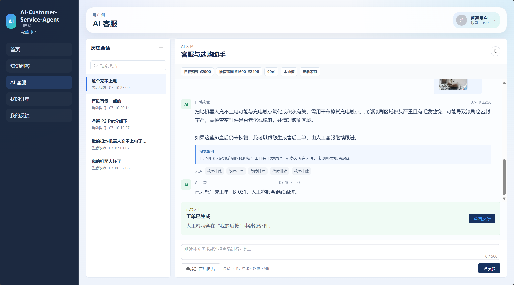

# AI Customer Service Agent

一个面向学习、课程展示和面试演示的智能客服系统。

项目围绕真实客服流程展开：顾客可以咨询商品、查询订单、提交售后问题并上传图片；客服可以统一处理工单，参考 AI 生成的分析和回复建议，继续完成人工审核与跟进。

> 本项目以功能演示和学习交流为目标，不建议直接用于生产环境。

## 系统展示



## 可以体验什么

### 顾客侧

- 与 AI 客服连续对话，保留历史会话。
- 获取商品推荐并对比不同型号。
- 查询自己的订单、物流和使用记录。
- 描述设备故障，上传破损照片或故障截图辅助识别。
- 将未解决的问题转为人工工单，并继续查看处理进度。
- 提交普通反馈、补充图片和附件。
- 从订单页面发起退款售后申请。

### 客服与管理员侧

- 查看、筛选和处理顾客工单。
- 查看问题分类、优先级和情绪提示。
- 参考 AI 生成的回复草稿与相关资料。
- 查看顾客上传的售后图片及视觉识别摘要。
- 管理知识资料。
- 审核退款申请并跟进退款状态。

## 功能特点

- **图文售后**：支持上传售后图片，AI 会提取可见故障、破损和报错信息，识别结果仅作为辅助依据。
- **知识问答**：根据已有资料回答产品使用、维护和常见问题。
- **上下文对话**：结合当前问题和最近交流内容继续回复，减少重复询问。
- **人工接管**：AI 无法解决的问题可以整理为工单，由客服继续处理。
- **订单与退款**：顾客可查看订单并申请退款，退款结果仍需管理员审核确认。
- **效果评测**：提供测试用例，便于观察功能调整前后的表现变化。

## 快速开始

推荐使用 Docker Compose 启动完整项目。

### 1. 准备环境

请先安装：

- Docker Desktop
- Docker Compose

在项目根目录创建 `.env` 文件，并填写模型服务的 API Key：

```env
DASHSCOPE_API_KEY=your_api_key
```

如需修改数据库密码，可在同一文件中增加：

```env
MYSQL_ROOT_PASSWORD=your_password
```

请勿将 `.env` 或真实 API Key 提交到 Git。

### 2. 启动项目

```bash
docker compose up -d --build
```

启动完成后访问：

```text
http://localhost:5173
```

### 3. 使用演示账号

| 角色 | 账号 | 密码 |
| --- | --- | --- |
| 顾客 | `user` | `user123` |
| 管理员 | `admin` | `admin123` |

### 4. 停止项目

```bash
docker compose down
```

该命令不会主动清除数据库卷。请谨慎使用带 `-v` 的清理命令，以免删除本地演示数据。

## 推荐演示流程

1. 使用顾客账号进入 AI 客服，描述一个设备故障并上传图片。
2. 查看视觉识别摘要和排查建议。
3. 将问题生成人工工单。
4. 切换管理员账号，在工单管理中查看图片、问题分析和回复建议。
5. 返回顾客侧查看客服回复和处理进度。

还可以从“我的订单”发起退款申请，再切换管理员账号体验退款审核流程。

## 项目组成

```text
workOrderFrontend-main/   Web 页面
workOrderBackend-main/    客服与订单业务服务
workOrderAI/              AI 能力与评测
docs/                     项目图片和说明
docker-compose.yml        一键启动配置
```

主要使用 Vue 3、Spring Boot、FastAPI、MySQL 和通义千问模型完成。

## 项目说明

- 图片识别结果只用于辅助客服理解问题，不直接决定退款资格、金额或执行结果。
- 退款操作必须经过管理员审核，最终状态以业务系统为准。
- 演示账号和示例数据仅用于本地学习，请勿用于真实业务。
- 本地知识资料、上传文件、日志和测试结果不应提交到公开仓库。

## 项目来源

传统工单前后端参考：

- [Work Order Frontend](https://github.com/mxnican/workOrderFrontend)
- [Work Order Backend](https://github.com/mxnican/workOrderBackend)

本项目在此基础上增加了 AI 客服、知识问答、图文售后、订单退款和效果评测等演示能力。
